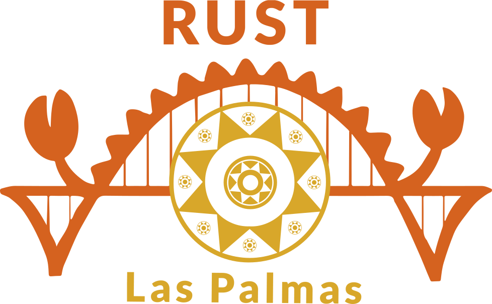

<a href="https://graphql.org/"></a>

# rust-gql-docs

> **mdBook** bilingüe (ES/EN) + **rustdoc** — el porqué de la migración GraphQL a Rust.

<br clear="left"/>

English: [README.md](./README.md)

Documenta el port del taller GraphQL de GofiGeeks a Rust: el principio rector (un
único `schema.graphql` verificado por el compilador a ambos lados), la arquitectura,
el mapeo de dependencias y cómo se verifica todo. El libro enlaza los items de código
a su fuente en la referencia de API generada (rustdoc).

## Estructura

- `es/`, `en/` — los dos mdBooks (cada uno con su `book.toml` + `src/`).
- `book/` — salida del build: `index.html` (portada de idioma), `es/`, `en/`, `rustdoc/`.

## Requisitos

- [`mdbook`](https://rust-lang.github.io/mdBook/) (`cargo install mdbook`)
- Rust **1.95+** con `cargo` (para la parte de rustdoc)

## Construir

```bash
# sólo el libro (por idioma)
mdbook build es      # -> book/es
mdbook build en      # -> book/en

# sitio completo: libro (ES/EN) + referencia API (rustdoc) en paralelo
scripts/build-docs.sh     # desde la raíz del workspace -> book/{es,en,rustdoc}

# servir
python3 -m http.server 3000 --directory book   # abre http://localhost:3000
```

## El ecosistema

Este repo **documenta** los repos de código:

| Repo | Qué aporta |
|------|------------|
| [rust-gql-domain](https://github.com/rust-laspalmas/rust-gql-domain) | newtypes + validación compartidos |
| [rust-gql-backend](https://github.com/rust-laspalmas/rust-gql-backend) | el servidor; emite `schema.graphql` |
| [rust-gql-frontend](https://github.com/rust-laspalmas/rust-gql-frontend) | el cliente Leptos wasm |
| **rust-gql-docs** (este) | el mdBook + rustdoc que los explican |

---

<a href="https://rust-laspalmas.dev/"></a>

<br>

Parte de la exploración de aprendizaje **GraphQL de GofiGeeks → Rust** por
[Rust Las Palmas](https://rust-laspalmas.dev) · [jesusperez.pro](https://jesusperez.pro).

No es un fork del taller — es un complemento.

<br clear="left"/>
